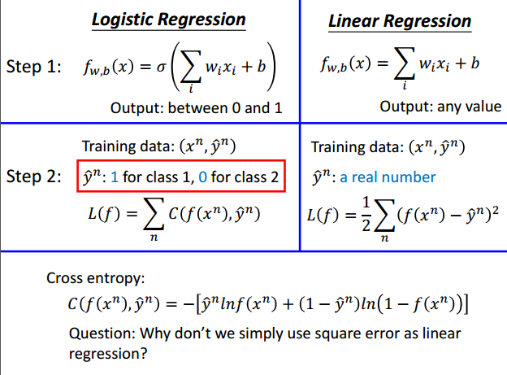
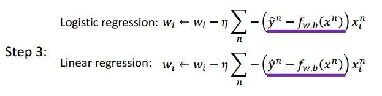
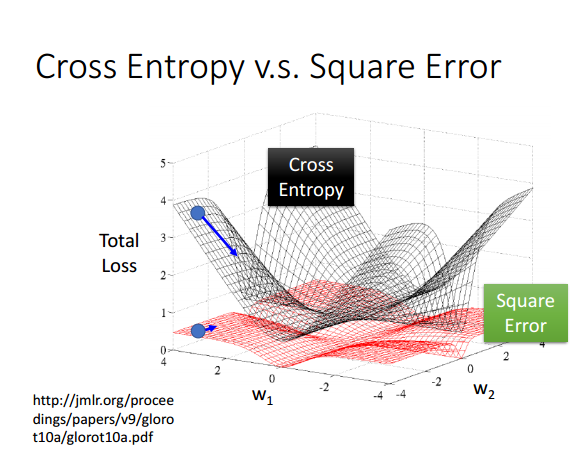
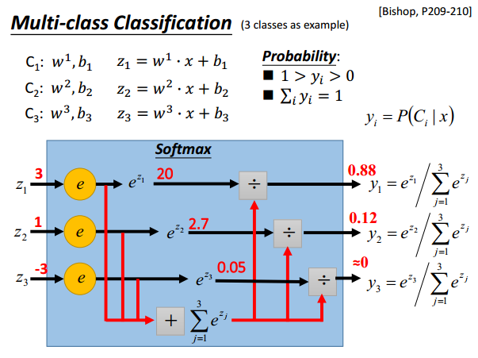
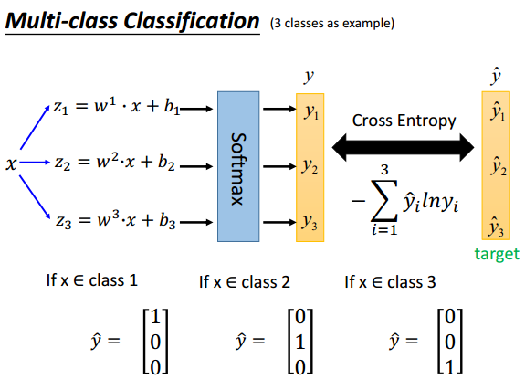
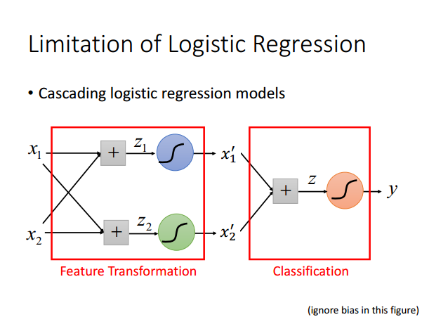

# 逻辑回归

## 基本思想

判别模型：直接通过训练数据学习概率$p(C_1|x)$,样本$x$属于$C_1$的概率。

$$f_{w,b}(x)=p_{w,b}(C_1|x)=\sigma (z)=\sigma(w^T+b)$$
激活函数： $$\sigma(z)=\frac{1}{1+e^{-z}}$$
计算的值，大于0.5则属于$C_1$ 。

对于训练数据：$x=[x_1,x_2,\cdots,x_n]^T,y=[y_1,y_2,\cdots,y_n]^T,y_1,y_2,\cdots \in \{C_1,C_2\}$
若：
| $x_1$ | $x_2$ | $x_3$ | $\cdots$ | $x_n$ |
|-----  |----   |-----  |----------|-----  |
| $C_1$ |$C_1$  |$C_2$  |$\cdots$  |$C_1$  |

生成数据的概率：
$$L(w,b)=f_{w,b}(x_1)f_{w,b}(x_2)(1-f_{w,b}(x_3)) \cdots f_{w,b}(x_n)$$
优化参数：$w,b$

$$
\begin{align}
  w^*,b^*
  & = \arg \max_{w,b} L(w,b) \\
  & = \arg \min_{w,b} -\ln L(w,b) \\
  & = \arg \min_{w,b} -\sum_n \hat{y}^n \ln f_{w,b}(x^n)+(1-\hat{y}^n) \ln (1-f_{w,b}(x^n)) \\
\end{align}
$$
$$\hat{y}^n = 1 \ for:C_1\\
\hat{y}^n = 0 \ for:C_2
$$

cross entropy:

$$H(p,q)=-\sum_x p(x) \ln q(x) $$

## 逻辑回归与线性回归比较

## cross entropy 与平方误差对比

##  多分类问题

## 逻辑回归局限

不能解决线性不可分问题。需要进行特征变换。

