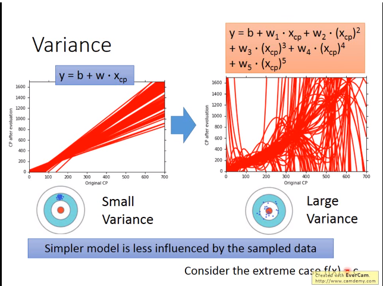
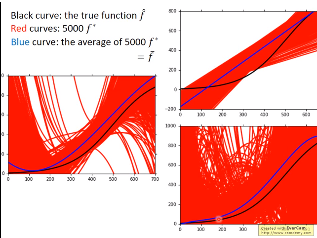
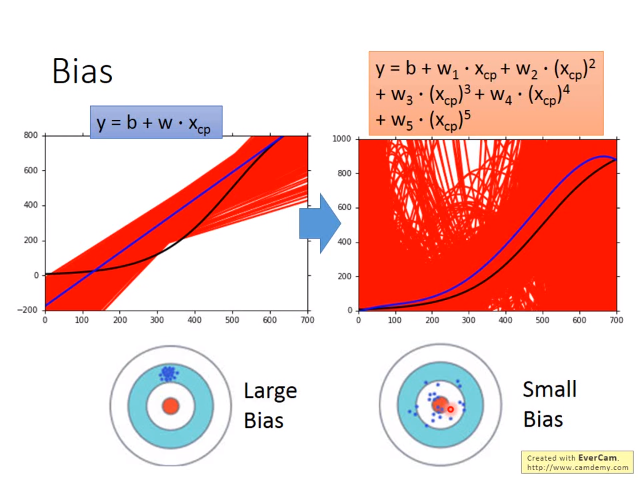
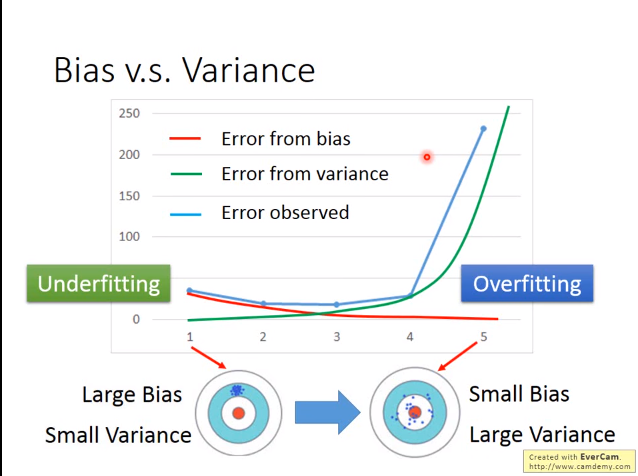

# 误差的来源 —— 偏差与方差#

 对于训练数据，同一个模型函数对于不同的数据，有不同的假设$f^*$，这些假设对于真实的函数$\hat{f}$存在方差和偏差，影响最终的结果。

随着模型复杂度的提高，方差逐渐增大。

而均值函数$\bar{f}$与真实函数$\hat{f}$的偏差则逐渐减小。

> **方差**：反映了$f^*$的分散程度。
>
> **偏差**：反映了$f^*$的期望$\bar{f}$与真实函数$\hat{f}$的偏离程度。

> **underfiting**:模型不足以拟合training data。大的偏差，小的方差。
>
> **overfiting**:模型过于复杂，对于training data很好拟合，但对于testing data则效果很差。小的偏差，大的方差。

解决方法：

> 欠拟合：使用更加复杂的模型，or 添加其他特征。
>
> 过拟合：增加数据量，or regularization。

交叉检验与N折交叉检验
