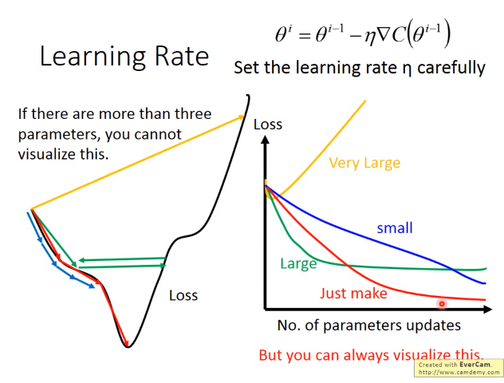

#梯度下降法

## 损失函数的优化问题

$$\theta^*=arg \min_\theta L(\theta)$$ 	$L$:loss function	$\theta$:参数

梯度：
$$
\nabla L(\theta)=\begin{bmatrix}
\partial L(\theta_1)/ \partial \theta_1\\
\partial L(\theta_2)/ \partial \theta_2\\
\end{bmatrix}
$$
参数$\theta=\begin{bmatrix} \theta_1 \\ \theta_2\end{bmatrix}$。
$$
\theta^1=\theta^0-\eta \nabla L(\theta)
$$
上标表示第$i$次迭代的结果。$\eta$为步长。

## 步长的选择

> 步长过小：计算时间长
>
> 大甚至过大：收敛不到最小值点，甚至发散
>
> 合适的步长：需要调整得到
