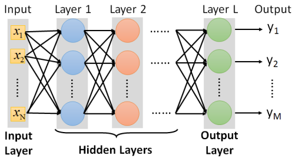
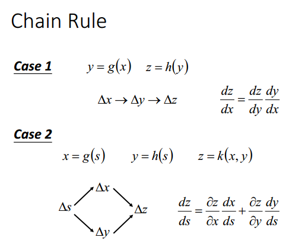
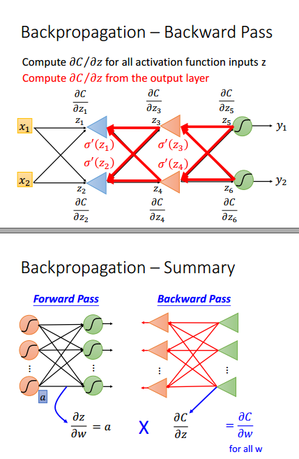

# deep learning and backpropagation
一个神经元就是一个逻辑回归单元。

一个神经网络就是一个function。

## 典型的神经网络结构：

## 优化问题

单个样本的损失函数：
$$\text{cross entropy:} \ C(\hat{y},y)=-\sum_{i=1}^m \hat{y_i}\ln y_i $$
其中$i$为类别数。
总的损失函数：$n$为样本总数。
$$ L=\sum_n^N C^n $$
$$\theta ^* = \arg \min L(\theta)$$
其中：$\theta=\{w_1,w_2,\cdots,b_1,b_2,\cdots\}$
## 基本方法：梯度下降法

### 反向传播算法
#### 实质是梯度下降算法。
$$
\theta_1=\theta_0-\eta\nabla L(\theta_0)
$$

$$
\nabla L(\theta)=\begin{bmatrix}
\frac{\partial L}{w_1}\\
\frac{\partial L}{w_2}\\
\vdots\\
\frac{\partial L}{b_1}\\
\frac{\partial L}{b_2}\\
\end{bmatrix}
$$
#### chain rule

#### forward pass and backward pass

