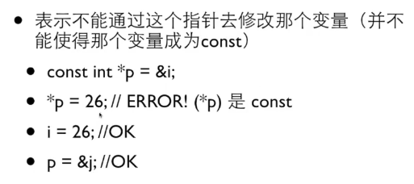
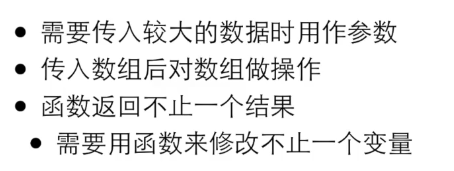

## 标准头文件与extern "C"
```c++
//为了使代码在c语言和c++中都能够使用，使用如下方法在头文件中。
#ifdef __cplusplus /* 如果采用了C++，如下代码使用C编译器 */
    extern "C" { /*extern "c"使用c语言的编译规则。 如果没有采用C++，顺序预编译 */
#endif
/* 采用C编译器编译的C语言代码段 使用了extern "c"则不能使用函数重载，因为c语言中不允许函数名在编译后修改。*/
#ifdef __cplusplus /* 结束使用C编译器 */
    }
#endif
```
## 宏
带参数的宏要记得带括号，避免替换时，运算优先级发生改变。
> 整个值要加括号
> 参数出现的地方加括号
> 如：`#define RANDTODEG(x) ((x)*57.29678)`

## 数组与指针

```c++
#include <stdio.h>  
  
int a[2] = {1,2};  
int main(){  
        printf("a = %p\n", a); // I  
        printf("&a = %p\n", &a); // II  
        printf("a + 1 = %p\n", a + 1);// III  
        printf("&a + 1 = %p\n", &a + 1);// IV  
  
        return 0;  
}  

\\输出
a = 0x804a014
&a = 0x804a014
a + 1 = 0x804a018
&a + 1 = 0x804a01c
```
在以下两中场合下，数组名并不是用指针常量来表示，就是当数组名作为sizeof操作符和单目操作符&的操作数时。 sizeof返回整个数组的长度，而不是指向数组的指针的长度。 取一个数组名的地址所产生的是一个指向数组的指针，而不是一个指向某个指针常量的指针。
所以&a后返回的指针便是指向数组的指针，跟a（一个指向a[0]的指针）在指针的类型上是有区别的。
所以取得一个数组的长度可以使用：

```c++
int a[] = {1, 2, 3, 4, 5};
int length = sizeof(a)/sizeof(a[0]);
```
数组作为函数参数时，可以将其改为指针传入。
如：
```c++

void max(int a[], int length, int *max);
\\也可以用下面形式表示
void max(int *a, int length, int *max);
\\同时指针a,也可以当做数组访问，如a[1],此外还有a+1,同样对于数组名a也可当做指针使用。
```

### 指针常量与常量指针

```c++
int a = 1;
const int * b;
b = &a;//指针指向的值是常量，所以不能改变 *b 的值
// *b = 5;//是错误的，但是可以改变a的值，如 a = 2 只是不能通过*b来改变指针b指向的值。

int c = 1;
int * const d = &c;//指针d是常量，所以必须首先初始化。
// d = &a;错误，常量不可以改变值。 
*d = 2;//c的值可以改变。
```



```c++
int a[] <==> int * const a
//所以a是const指针，不能修改a的值，
//故下面做法是错误的

int a[] = {1, 2, 3};
int b[3];
b = a;//错误

const int a[3] = {1, 2, 3};
//表示数组a 中的值都是const int 类型的
```

```c++
*p++
\\ ++ 运算符的优先级要高于 * 运算符。目的是取出指针p指向的值后，将指针p加1。
```
### 什么时候会用到指针？



## inline 函数
对于某些使用频繁，但体积较小的函数，可以考虑使用内联函数，避免了使用一般函数时的额外开销，提高效率。
在c语言中，可以使用带参数的宏来代替。

使用方法，在函数前加上inline 关键字。

内联函数和宏的区别：
1. 内联函数需要对参数进行类型检查
2. 对实参表达式首先求值，在传递给形参。
3. 带参数宏只是简单替换。
4. 内联函数是在编译时展开，宏是预处理时展开。
