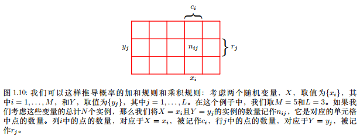
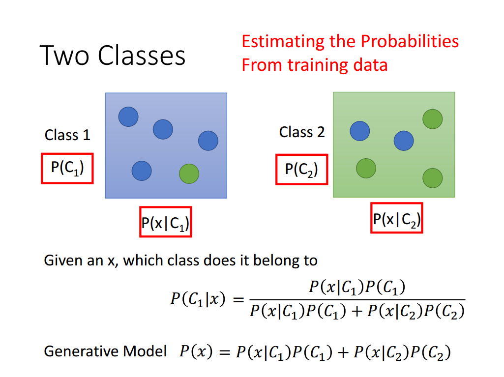
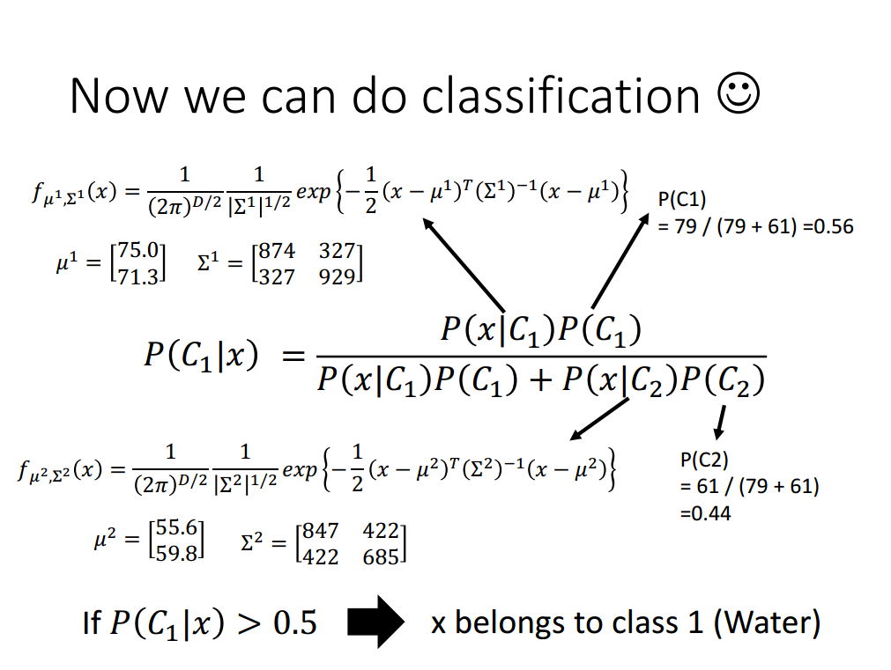
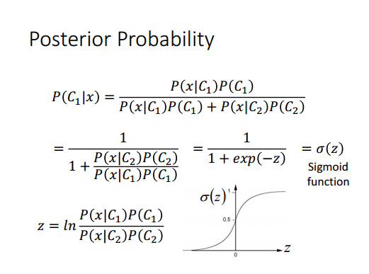
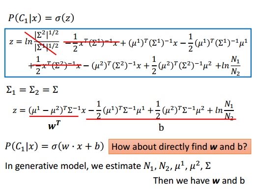

# 分类问题

## 概率论基础知识

1. 加和规则 	 $p(X)=\sum_Y p(X,Y)$
2. 乘积规则   $p(X,Y)=p(Y|X)p(X)$

考虑随机变量$X$和$Y$

$X=x_i$且$Y=y_j$ 的联合概率：

$p(X=x_i,Y=y_j)=\frac{n_ij}{N}$

$X=x_i$ 的概率：

$p(X=x_i)=\frac{c_i}{N}=\frac{\sum_{j=0}^L n_{ij}}{N}=\frac{\sum_{j=0}^L p(X=x_i,Y=y_j)*N}{N}=\sum_{j=0}^L p(X=x_i,Y=y_j)$

上述公式，即为**加和规则** 。$p(X=x_i)$ 也称为边缘概率。

$p(X=x_i,Y=y_j)=\frac{n_{ij}}{N}=\frac{n_{ij}}{c_i} \frac{c_i}{N}=p(Y=y_j|X=x_i)p(X=x_i)$

称为概率的**乘积规则**。

   $$p(X,Y)=p(Y|X)P(X)=p(Y,X)=p(X|Y)p(Y)$$

即:
​	$$p(Y|X)=\frac{p(X|Y)p(Y)}{p(X)}=\frac{p(X|Y)p(Y)}{\sum_Y{p(X,Y)}}=\frac{p(X|Y)p(Y)}{\sum_Y{p(X|Y)p(Y)}}$$

贝叶斯定理：$Y$ 对 $X$ 的条件概率可由 $X$ 对 $Y$ 的条件概率计算得到。

## 二分类问题

### 生成模型 Generative

   ​

   考虑盒子和蓝绿球：

   

   ​

现抽一个绿球，求该球来自于class 1的概率：

$$P(C_1|x)$$可通过贝叶斯定理求出。

这是生成模型的思想，学习的是模型，如上图中，分别学习两个类别的模型，$p(x|C_1),p(x|c_2)$来求得新样本属于类别的概率：$p(C|x)$ 。实质上，生成模型学习的是联合概率$p(X,Y)$ 。分子部分$p(x|C_1)p(C_1)$

考虑这样一个例子，假设给定动物的若干个特征属性，我们希望通过这些特征学习给定的一个“个体”到底是属于“大象”（$y=1$）还是“狗”（$y=0$）。如果采用判别模型[^1]的思路，如逻辑回归，我们会根据训练样本数据学习类别分界面，然后对于给定的新样本数据，我们会判断数据落在分界面的哪一侧从而来判断数据究竟是属于“大象”还是属于“狗”。在这个过程中，我们并不会关心，究竟“大象”这个群体有什么特征，“狗”这个群体究竟有什么特征。

现在我们来换一种思路，我们首先观察“大象”群体(training data)，我们可以根据“大象”群体特征**建立模型**，然后再观察“狗”群体特征，然后再建立“狗”的模型。当给定新的未知个体时，我们将该个体分别于“大象”群体和“狗”群体模型进行概率比较，看这个个体更符合哪个群体模型的特征。

核心的方法是对于同一类数据，假定服从一种分布，如高斯分布，对于新的样本，计算其属于不同类别的分布的概率。

对于一类训练样本，计算特征均值和方差矩阵，通过下式计算概率：
$$f_{\mu,\Sigma}=\frac{1}{(2\pi)^{D/2}} \frac{1}{|\Sigma|^{1/2}} \exp \left\{-\frac{1}{2} (x-\mu)^T \Sigma^{-1} (x-\mu)\right\}$$

通常，不同类别的$\Sigma$选取一样。

在使用高斯模型对每一类别的特征数据进行建模时，$p(C_1|x)$是符合逻辑回归模型的，但是如果满足有$p(C_1|x)$符合逻辑回归模型，并不能一定得到数据特征分布是高斯分布这个结论，所以反向推导是不成立的！实际上，当类别数据特征分布满足如泊松分布（Poisson Distribution）时，也可以得到$p(C_1|x)$是满足逻辑回归模型的。

总的说来，GDA（高斯生成算法）对数据分布进行了一定的假设（假设数据分布是高斯分布的），当数据确实符合或近似符合高斯分布时，这种计算方法是比较高效准确的；但是当数据并不符合高斯分布时，这种计算方法的效果并不是很好，而逻辑回归并不存在这样的假设，所以当数据不满足高斯分布时，逻辑回归分类的效果要更好一些。

常用的生成模型[^1]有朴素贝叶斯，隐马尔可夫等，HMM等。

* 朴素贝叶斯模型：特征之间是相互独立的。
$$p(x|C_1)=p(x_1|C_1)p(x_2|C_1) \cdots p(x_n|C_1)$$
$$x=[x_1,x_2,\cdots,x_n]^T$$
**判别模型的实质：**

详细推导见 李宏毅 classification pdf文件

可见，生成模型，通过计算概率的方式，求出合适的$w$ 和$b$,其值和假设的模型分布有关。而判别模型直接学习分布概率$p(C_1|x)$

### 判别模型

基本思想[^2]是有限样本条件下建立判别函数，不考虑样本的产生模型，直接研究预测模型。典型的判别模型包括k近邻，感知级，决策树，支持向量机等。

### 生成模型和判别模型的优缺点
在监督学习中，两种方法各有优缺点，适合于不同条件的学习问题。

生成方法的特点：上面说到，生成方法学习联合概率密度分布P(X,Y)，所以就可以从统计的角度表示数据的分布情况，能够反映同类数据本身的相似度。但它不关心到底划分各类的那个分类边界在哪。生成方法可以还原出联合概率分布P(Y|X)，而判别方法不能。生成方法的学习收敛速度更快，即当样本容量增加的时候，学到的模型可以更快的收敛于真实模型，当存在隐变量时，仍可以用生成方法学习。此时判别方法就不能用。

判别方法的特点：判别方法直接学习的是决策函数Y=f(X)或者条件概率分布P(Y|X)。不能反映训练数据本身的特性。但它寻找不同类别之间的最优分类面，反映的是异类数据之间的差异。直接面对预测，往往学习的准确率更高。由于直接学习P(Y|X)或P(X)，可以对数据进行各种程度上的抽象、定义特征并使用特征，因此可以简化学习问题。

### 生成模型和判别模型的联系
由生成模型可以得到判别模型，但由判别模型得不到生成模型。
[^1]: http://blog.csdn.net/Fishmemory/article/details/51711114
[^2]: http://blog.csdn.net/zouxy09/article/details/8195017
